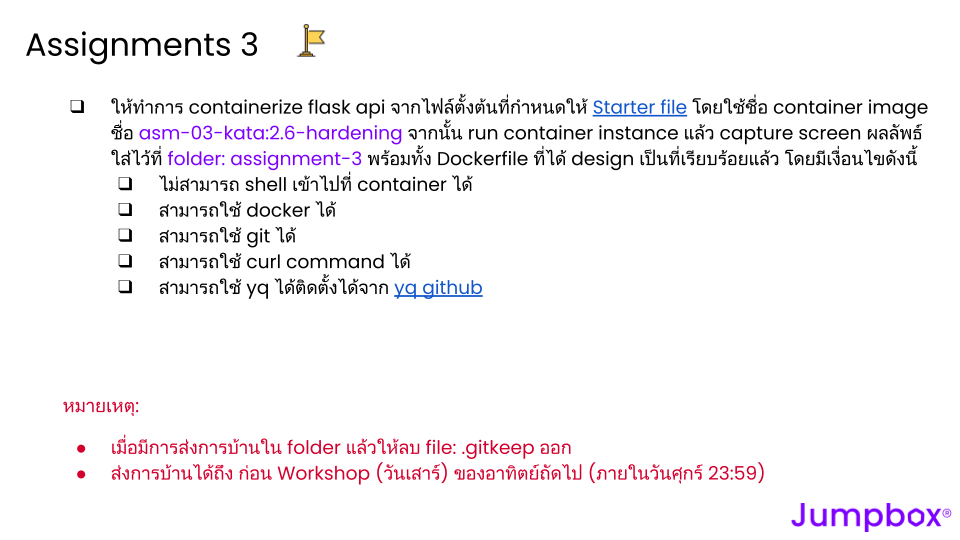

# 03-container-orchestration

## Assignment 1 
ให้ทำโจทย์ที่กำหนดให้จากรูปภาพต่อไปนี้ 

ให้ทำโจทย์ที่กำหนดให้ใน Google Doc โดยการ Make a copy เมื่อทำเสร็จแล้วให้ Download ในรูปแบบ pdf แล้วนำมาใส่ไว้ที่ `folder: assignment-1`
ให้ทำการ containerize flask api โดยใช้ base image เป็น `ubuntu:22.04` ที่จากไฟล์ตั้งต้นที่กำหนดให้ [Starter file](https://gist.github.com/sikiryl/f89e790c450f7e6b9e82d0a710019634) โดยใช้ชื่อ container image ชื่อ `asm-01-kata:2.6` จากนั้น run container instance แล้ว capture screen ผลลัพธ์ใส่ไว้ที่ `folder: assignment-1` พร้อมทั้ง Dockerfile ที่ได้ design เป็นที่เรียบร้อยแล้ว

## Assignment 2 
ให้ทำโจทย์ที่กำหนดให้จากรูปภาพต่อไปนี้ 

ให้ทำการ containerize flask api โดยใช้ base image เป็น `debian series` ที่จากไฟล์ตั้งต้นที่กำหนดให้ [Starter file](https://gist.github.com/sikiryl/f89e790c450f7e6b9e82d0a710019634) โดยใช้ชื่อ container image ชื่อ `asm-02-kata:2.6` จากนั้น run container instance แล้ว capture screen ผลลัพธ์ใส่ไว้ที่ `folder: assignment-2` พร้อมทั้ง Dockerfile ที่ได้ design เป็นที่เรียบร้อยแล้ว

## Assignment 2-2

จากข้อ Assignment 2 ให้ `optimize container image` ให้ `ไม่เกิน 150MB` ลบไฟล์ที่ไม่จำเป็นใน Container Image เปลี่ยน Type ของ base image
โดยใช้ชื่อ container image ชื่อ `asm-02-2-kata:2.6` run container instance แล้ว capture screen ผลลัพธ์ใส่ไว้ที่ `folder: assignment-2-2` พร้อมทั้ง Dockerfile ที่ได้ design เป็นที่เรียบร้อยแล้ว

## Assignment 3 
ให้ทำโจทย์ที่กำหนดให้จากรูปภาพต่อไปนี้ 

ให้ทำการ containerize flask api จากไฟล์ตั้งต้นที่กำหนดให้ [Starter file](https://gist.github.com/sikiryl/f89e790c450f7e6b9e82d0a710019634) โดยใช้ชื่อ container image ชื่อ `asm-03-kata:2.6-hardening` จากนั้น run container instance แล้ว capture screen ผลลัพธ์ใส่ไว้ที่ `folder: assignment-3` พร้อมทั้ง Dockerfile ที่ได้ design เป็นที่เรียบร้อยแล้ว โดยมีเงื่อนไขดังนี้
- ไม่สามารถ shell เข้าไปที่ container ได้
- สามารถใช้ docker ได้
- สามารถใช้ git ได้
- สามารถใช้ curl command ได้
- สามารถใช้ yq ได้ติดตั้งได้จาก [yq github](https://github.com/mikefarah/yq)